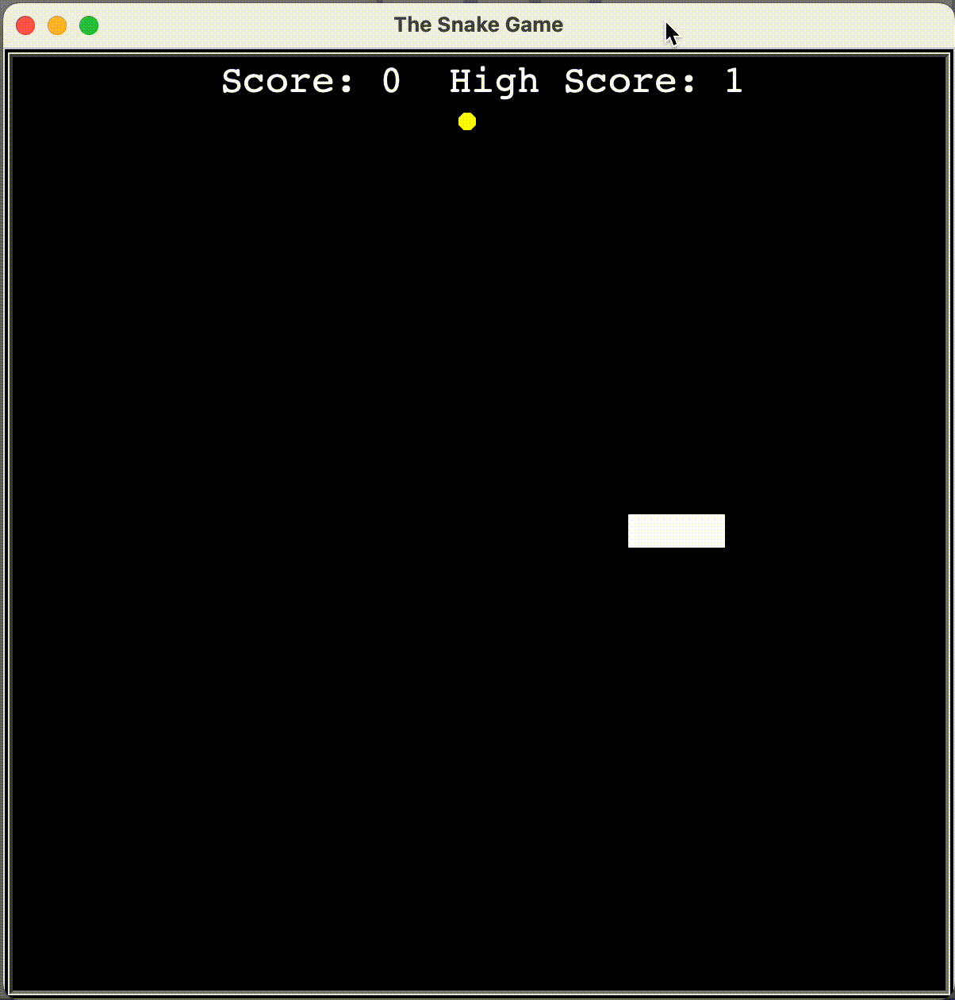

# The Snake Game
The Snake Game is a modern take on the classic arcade game, implemented with Python’s turtle graphics. In this updated version, the game no longer ends on collision—instead, it automatically resets while tracking and persisting your high score across sessions. Eat food pellets to grow longer and rack up points; hit a wall or your own tail, and you’ll restart with your current score compared to the all-time high score stored in `high_score.txt`.

## Features
- **Continuous Play with Reset:**
Collisions with walls or the snake’s own body reset the game board instead of ending the program, keeping you in the action.

- **Persistent High Score:**
Tracks your session high score and writes it to high_score.txt, so your best performance is remembered across runs.

- **Dynamic Growth:**
Each time the snake eats food, it grows by one segment, making navigation increasingly challenging.

- **Score Tracking:**
Displays both your current session score and the all-time high score at the top of the screen.

- **Smooth Controls & Animation:**
Use arrow keys for real-time snake direction changes; the game loop updates at a steady pace for fluid movement.

## Modules Overview
- `main.py`:
  - Sets up the game screen, ties together Snake, Food, and Scoreboard, and contains the main loop with collision and reset logic.

- `snake.py`:
  - Defines the Snake class, handling creation, movement, growth, and resetting of the snake segments.

- `food.py`:
  - Defines the Food class, which creates and refreshes food pellets at random locations.

- `scoreboard.py`:
  - Defines the Scoreboard class, displaying current and high scores and managing high-score persistence.


## Installation

### Prerequisites

- **Python 3.x:** Ensure that Python 3 is installed on your system. You can download it from [Python's offical website](python.org).

- **Turtle Module:**
The turtle module is included with the standard Python distribution.

- **Time Module and Random Module:**
These are part of Python's standard library and are used for controlling game speed and generating random positions/movements respectively.

- **A Writable `high_score.txt` File:**
In the project directory, create an empty file named `high_score.txt` containing 0. The game will update this file automatically.

### How to Run

1. **Download the Code:** Clone the repository or make sure you have all the following files in the same directory:
   - main.py

   - food.py

   - snake.py

   - scoreboard.py

   - high_score.txt   ← containing a single `0`

2. **Open Terminal/Command Prompt:** Navigate to the directory containing the file.

3. **Run the program:** Execute the following command:

    ```bash
    python3 main.py
    ```

4. **Play the Game:**
   - Use the Up, Down, Left, and Right arrow keys to steer the snake. 
   - Eat the yellow food pellets to grow and increase your score. 
   - Colliding with a wall or your own body resets the board—try again to beat your high score!
 
5. **Exit:**
Click the game window or press Ctrl+C in the terminal.

## Demo


## License

This project is open-source and available under the [MIT License](https://choosealicense.com/licenses/mit/).


## Authors

- Ivis Perdomo [@ivyper](https://www.github.com/ivyper)

